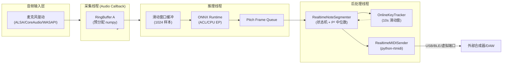
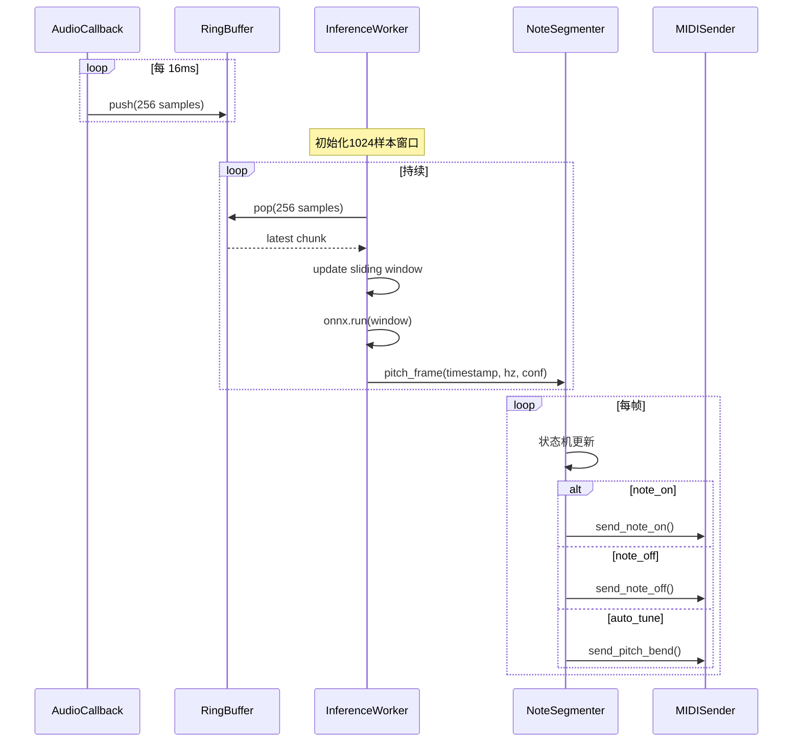
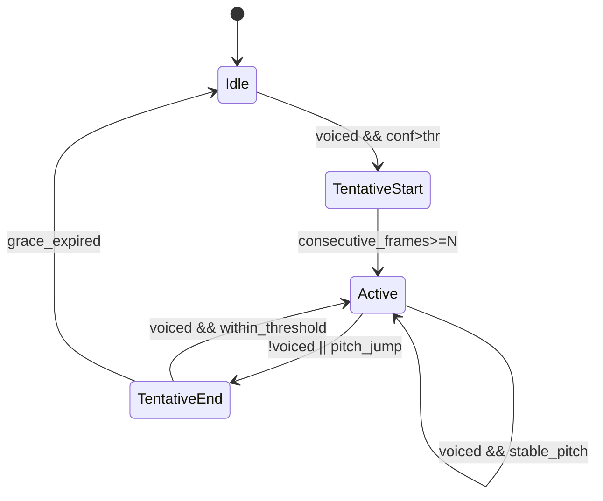

# SwiftF0 实时流式架构设计方案

**版本**：v1.0  
**日期**：2025-10-13  
**适用范围**：SwiftF0 Phase 4.x 流式音频处理与 MIDI 输出系统

---

## 1. 架构概览



### 模块说明

- **音频输入层**：通过 `sounddevice.InputStream` 以回调模式捕获 16kHz、单声道音频，每帧 256 样本（16ms）。  
- **采集线程**：回调函数将原始 `float32` 缓冲复制到预分配 ring buffer，避免动态分配。  
- **推理线程**：持续从 ring buffer 拉取数据，维持 1024 样本滑动窗口，调用 ONNX Runtime 生成 pitch/confidence 帧，每步输出 1 帧结果。  
- **后处理线程**：实现音符状态机、调性检测、Auto-tune 以及 MIDI 事件发送，确保音频路径与后处理解耦。  
- **反馈链路**：调性检测模块向状态机提供实时 tonal context，以支持 Auto-tune 与音域限制。

---

## 2. 线程模型设计

| 线程 | 优先级 | 职责 | 关键技术 | 性能目标 |
| --- | --- | --- | --- | --- |
| Audio Callback | 实时（最高） | 采集音频，写入 ring buffer | sounddevice RawCallback, lock-free buffer | <1ms 处理时间 |
| Inference Worker | 高 | 滑动窗口组装、ONNX 推理、voicing 判定 | NumPy、ONNX Runtime、io_binding | 单帧推理 <12ms（Raspberry Pi） |
| Post-processing Worker | 中 | Note 状态机、调性更新、MIDI 输出 | RealtimeNoteSegmenter, python-rtmidi | <4ms |
| Supervisor | 低 | 监控、日志、CPU 调整 | asyncio、psutil | 每 1s 巡检 |

### 调度策略

- 使用 `threading.Thread` + `daemon=True` 启动工作线程；  
- 在 Linux/树莓派上，使用 `os.sched_setscheduler` 或 `chrt` 提升音频线程优先级；  
- 每个线程绑定特定 CPU 核（`taskset`）以减少 cache thrash。

---

## 3. 数据流与状态管理



### 滑动窗口实现

```python
WINDOW_SIZE = 1024
HOP = 256
history = np.zeros(WINDOW_SIZE, dtype=np.float32)

def update_window(new_chunk):
    history[:-HOP] = history[HOP:]
    history[-HOP:] = new_chunk
    return history
```

### 状态机摘要

| 状态 | 进入条件 | 退出条件 | 动作 |
| --- | --- | --- | --- |
| IDLE | 无音符 | 置信度>阈值 | 初始化滑动窗口、记录开始时间 |
| TENTATIVE_START | 连续 voiced 帧 | 确认帧数达到阈值 | 发送 note_on |
| ACTIVE | 音符持续 | Pitch 跳变或未 voiced | 更新中位数/延长 note |
| TENTATIVE_END | 停顿或跳变 | grace 超时或恢复 | note_off 或回到 ACTIVE |

---

## 4. API 接口定义（伪代码）

```python
class StreamConfig(NamedTuple):
    sample_rate: int = 16000
    block_size: int = 256
    window_size: int = 1024
    hop_size: int = 256
    confidence_threshold: float = 0.9
    grace_period_ms: float = 24.0
    split_semitone_threshold: float = 0.7


class SwiftF0StreamEngine:
    def __init__(self, config: StreamConfig, provider: str = "CPUExecutionProvider"):
        self.config = config
        self.detector = SwiftF0(confidence_threshold=config.confidence_threshold)
        self.segmenter = RealtimeNoteSegmenter(
            split_threshold=config.split_semitone_threshold,
            grace_period_frames=int(config.grace_period_ms / (1000 * config.hop_size / config.sample_rate)),
        )
        self.key_tracker = OnlineKeyTracker(window_seconds=10.0)
        self.midi_sender = RealtimeMIDISender(port_name=None, instrument=56)

    def start(self):
        self._spawn_threads()
        self._open_stream()

    def stop(self):
        self.midi_sender.all_notes_off()
        self._close_streams()

    def process_audio_frame(self, frame: np.ndarray, timestamp: float):
        pitch_hz, confidence = self.detector.stream_infer(frame)
        events = self.segmenter.process_frame(
            pitch_hz=pitch_hz,
            confidence=confidence,
            timestamp=timestamp,
            key_context=self.key_tracker.current_key,
        )
        for event in events:
            self.midi_sender.send(event)
```

---

## 5. 配置参数建议

| 参数 | 默认 | 说明 | 可调范围 |
| --- | --- | --- | --- |
| `sample_rate` | 16000 | 兼容模型与低延迟 | 16000-22050 |
| `block_size` | 256 | 音频回调帧 | 128-512 |
| `window_size` | 1024 | 模型上下文 | 固定 |
| `hop_size` | 256 | 推理步长 | 128-256 |
| `confidence_threshold` | 0.9 | Voicing 判定 | 0.6-0.95 |
| `grace_period_ms` | 24 | note_off 延迟 | 10-60 |
| `split_semitone_threshold` | 0.7 | note 分割敏感度 | 0.5-1.2 |
| `auto_tune_strength` | 0.6 | pitch bend 混合权重 | 0-1 |
| `key_window_seconds` | 10 | 调性统计窗口 | 6-16 |
| `queue_maxsize` | 4 | 队列长度 | 2-8 |

---

## 6. 监控与容错

### 指标采集

- `audio_queue_fill_ratio`：用于检测是否发生 underrun/overrun；  
- `inference_latency_ms`：每帧推理耗时；  
- `end_to_end_latency_ms`：音频时间戳与 MIDI 发送时间差；  
- `cpu_usage_per_thread`、`temperature`（树莓派）。

### 故障处理

| 故障 | 检测方式 | 自愈策略 |
| --- | --- | --- |
| 音频溢出 | 回调 `status.input_overflow` | 丢弃历史缓冲，重置窗口 |
| 推理超时 | `latency > threshold` | 降低调用频率，报警 |
| MIDI 端口断开 | 异常捕获 | 自动重连；发送 all_notes_off |
| 调性检测失败 | 置信度 <0.3 | 回退默认调性 |

---

## 7. 兼容性与扩展

- **多平台**：  
  - macOS：CoreAudio + IAC 虚拟端口；  
  - Windows：WASAPI + loopMIDI；  
  - Linux：ALSA/JACK；  
  - Raspberry Pi：ALSA + PREEMPT_RT。
- **附加功能**：  
  - OSC 输出（通过 `python-osc`）；  
  - WebSocket API（用于前端可视化）；  
  - 云端模式（gRPC/REST 传输 pitch 数据）。

---

## 8. 图示总结



---

## 9. 交付清单

1. `SwiftF0StreamEngine` 类 + 线程管理器；  
2. `RealtimeNoteSegmenter` 与 `OnlineKeyTracker` 实现；  
3. 配套配置文件（YAML/JSON）；  
4. 监控与日志模块（结构化 log + Prometheus exporter 可选）；  
5. 部署脚本（树莓派 + 桌面环境）。

---

## 10. 结语

该架构采用模块化设计，将音频采集、模型推理、音乐语义与 MIDI 输出解耦，兼顾低延迟与扩展性。随着 Phase 4.x 的推进，可逐步引入 GPU/NPU 扩展、网络协同与 UI 可视化层，实现完整的实时 AI 卡祖笛体验。
